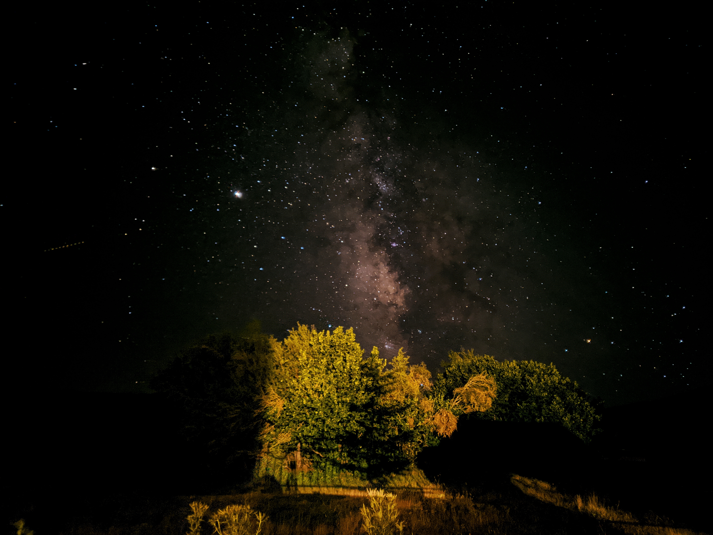
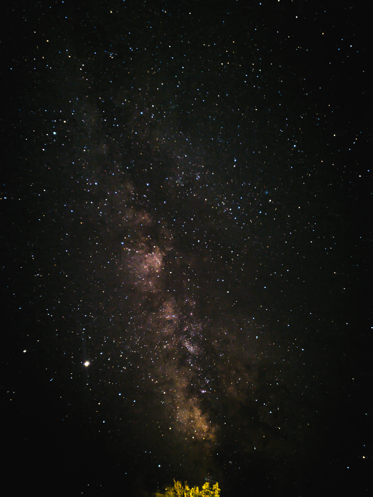

## Landscape view of the Milky Way

## Portrait view of the Milky Way
 

> Photos are taken in Voskopojë, Albania.
> 
> Taken on the Oneplus 6 using Ported Google Camera in Astrophotography mode.
>
> 4 minutes of exposure, post-edited in Snapseed with different settings.