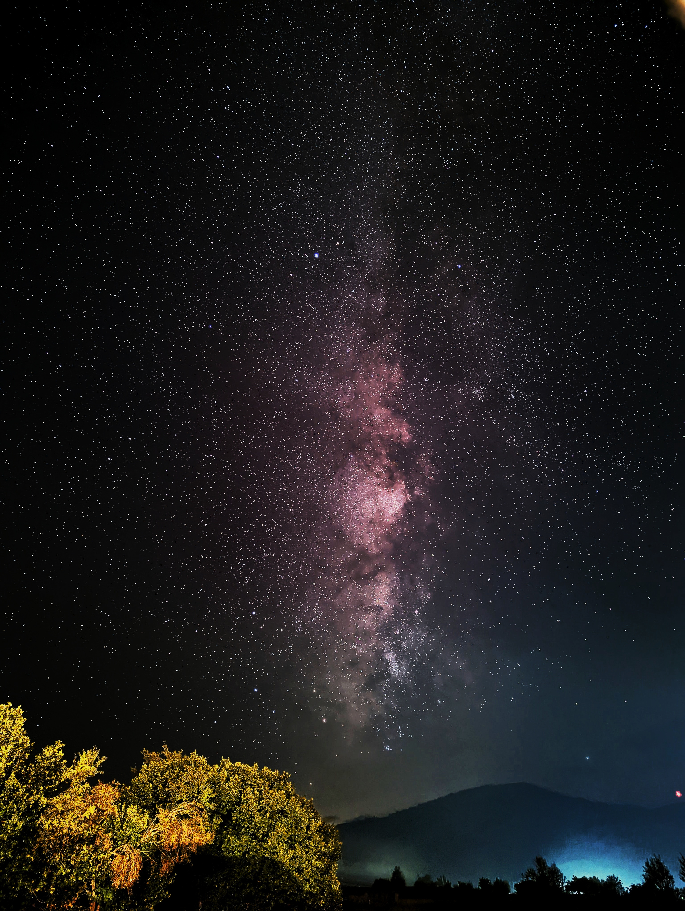
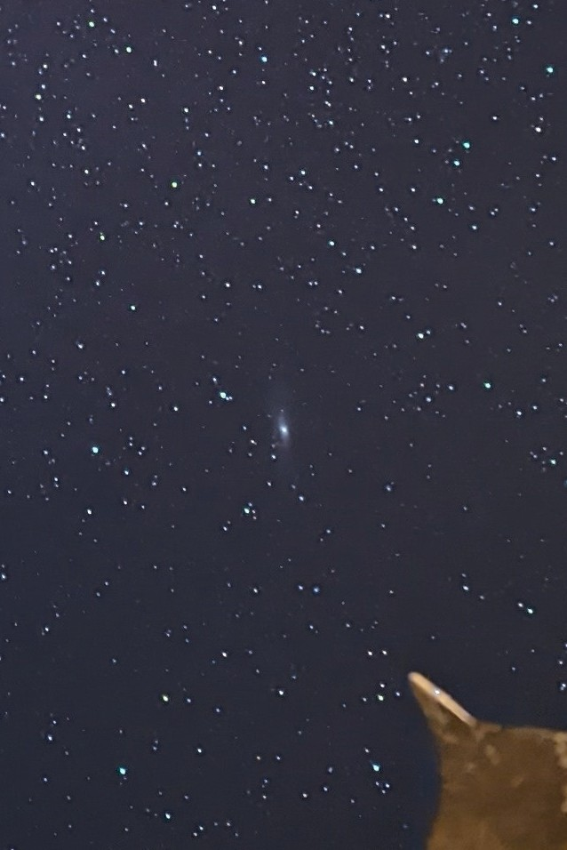

## Landscape view of the Milky Way

> Photo taken in Voskopojë, Albania.
> 
> Taken on the Pixel 6 using Google Camera in Astrophotography mode.
>
> 4 minutes of exposure, post-edited in Snapseed with different settings.

## Timelapse
<!-- [Milky Way Timelapse](milkyway_timelapse.mp4)
milkyway_timelapse.mp4
<video width="600" src="milkyway_timelapse.mp4"></video> -->


> Video created by merging 4 videos, 1 second each from the Astrophotography feature of the Pixel 6.

## Cropped image of the Andromeda galaxy
