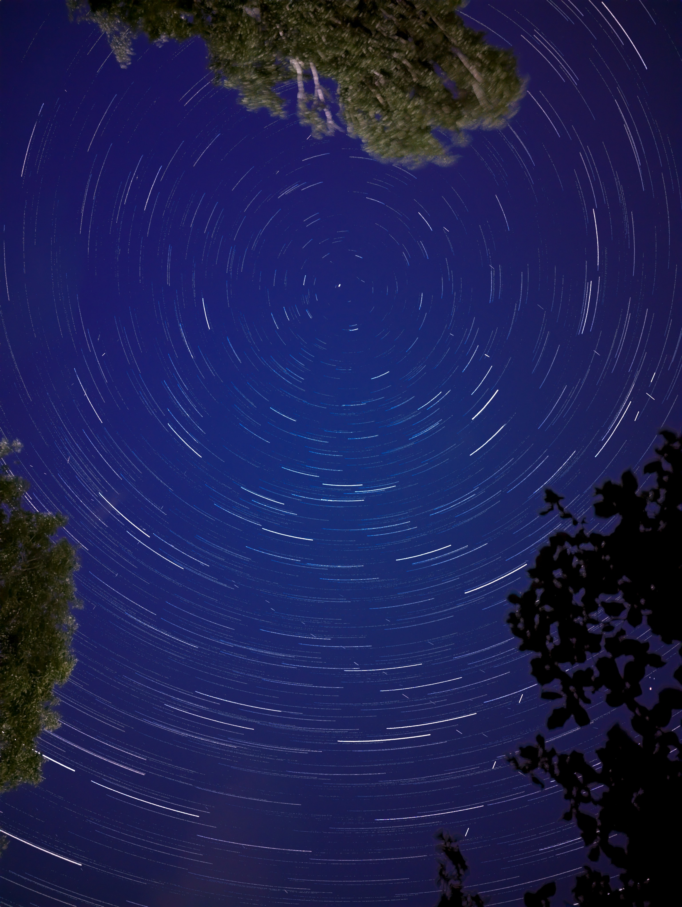
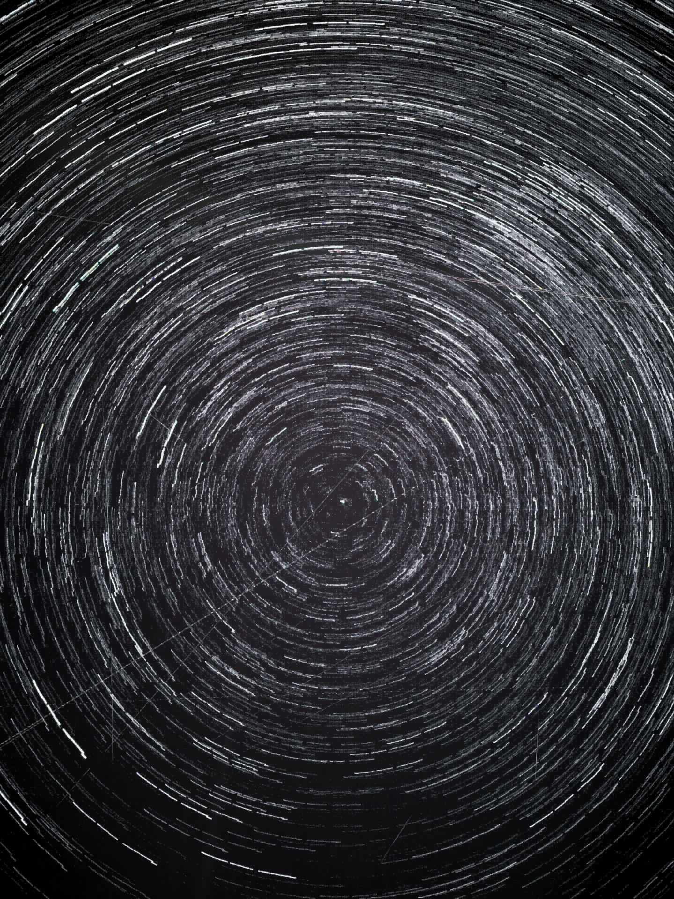
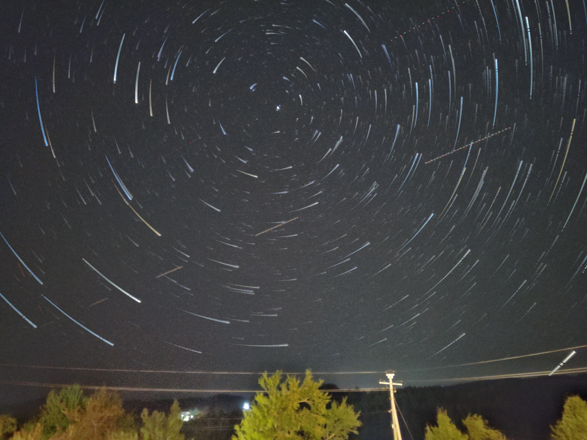

## Polaris Star Trails in Voskopoje


> Photo taken in Voskopojë, Albania.
> 
> Taken on the Pixel 7
>
>   - 1 hour total of photos
>   - Google Camera camera app with the night mode setting
>   - 6s exposure, 8s between each picture using the Intervalometer app
>   - Stitched together using StarStaX
>
> Post-edited in Lightroom with different settings.

### Timelapse


## Polaris Star Trails in Munich


> Photo taken in Munich.
> 
> Taken on the Pixel 7
>
>   - 1 hour total of photos
>   - Google Camera camera app with the night mode setting
>   - 6s exposure, 8s between each picture using the Intervalometer app
>   - Stitched together using StarStaX
>
> Post-edited in Lightroom with different settings.

### Timelapse


## Stitching in ffmpeg
Photos from StarStaX combined together using ffmpeg
```bash
ffmpeg -framerate 29 -pattern_type glob -i 'Star*.jpg' -vf scale=iw/2:ih/2,format=yuv420p -crf 18 -c:v libx264 outx264.mp4
```

## Star Trails From Video
  

 

> These are some of my first tries using images extracted from the short videos that the Astrophotography feature produces.
>
> ... and other methods

